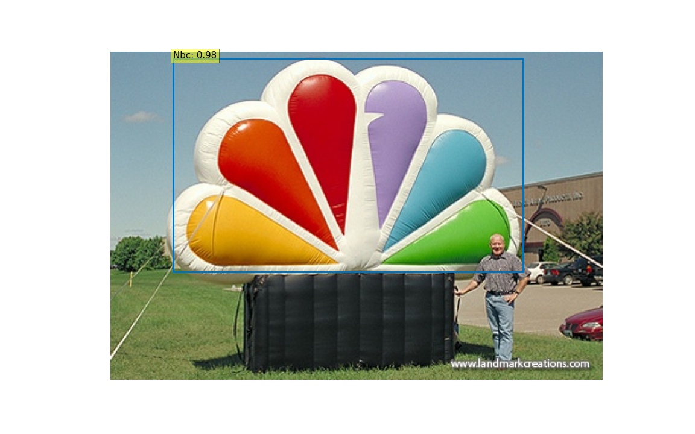
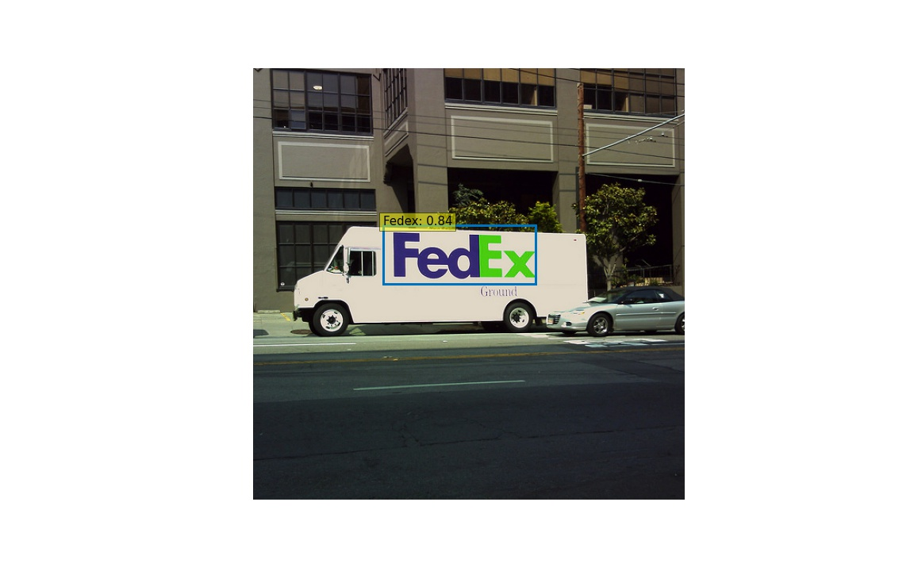
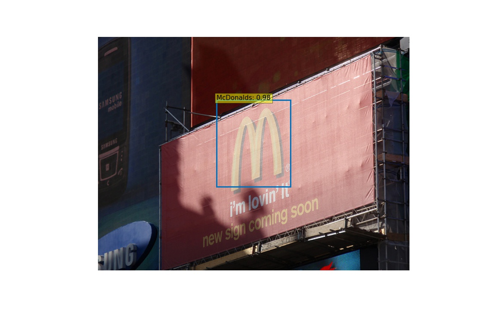
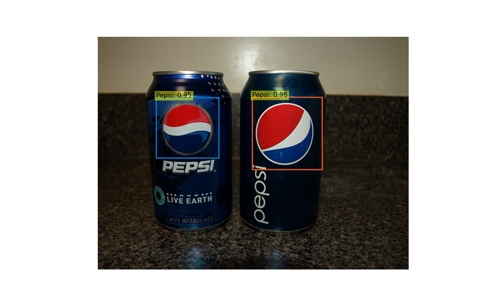
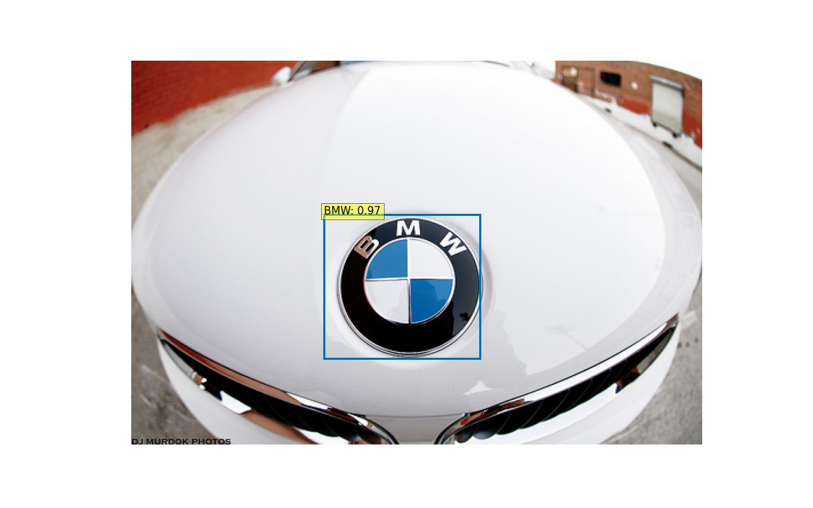

# DeepLogo2

A brand logo detection system using DETR.
(DeepLogo with Tensorflow Object Detection API is [here](https://github.com/satojkovic/DeepLogo))

# Description

[DETR](https://github.com/facebookresearch/detr) is a Transformer-based object detection model published by Facebook AI in 2020. Pytorch training code and pretrained models are also available on Github.

DeepLogo2 provides a training and inference environment for creating brand logo detection models using DETR.

# Detection results

|||
|---|---|
|||
|||
|||

# Dataset

DeepLogo2 use the [flickr logos 27 dataset](http://image.ntua.gr/iva/datasets/flickr_logos/).
The flickr logos 27 dataset contains 27 classes of brand logo images downloaded from Flickr. The brands included in the dataset are: Adidas, Apple, BMW, Citroen, Coca Cola, DHL, Fedex, Ferrari, Ford, Google, Heineken, HP, McDonalds, Mini, Nbc, Nike, Pepsi, Porsche, Puma, Red Bull, Sprite, Starbucks, Intel, Texaco, Unisef, Vodafone and Yahoo.

To fine-tuning DETR, the dataset is conveted to COCO format.

```bash
python preproc_annot.py
python flickr2coco.py --mode train --output_dir flickr_logos_27_dataset
python flickr2coco.py --mode test --output_dir flickr_logos_27_dataset
```

# Fine-tuning DETR

DeepLogo incorporates the DETR repository as a subtree, with the following changes for fine-tuning on the flickr logos 27 dataset.

Note: For code modifications for fine-tuning DETR, please refer to [woctezuma/detr_fine_tune.md](https://gist.github.com/woctezuma/e9f8f9fe1737987351582e9441c46b5d)

* Add custom dataset builder method(detr/datasets/flickr_logos_27.py, detr/datsets/`__init__`.py)

    ```python
    def build(image_set, args):
        root = Path(args.coco_path)
        assert root.exists(), f'provided root path {root} does not exist'
        train_json = 'flickr_logos_27_train.json'
        test_json = 'flickr_logos_27_test.json'
        PATHS = {
            "train": (root / 'flickr_logos_27_dataset_images', root / train_json),
            "val": (root / 'flickr_logos_27_dataset_images', root / test_json),
        }

        img_folder, ann_file = PATHS[image_set]
        dataset = CocoDetection(img_folder, ann_file, transforms=make_coco_transforms(image_set), return_masks=args.masks)
        return dataset
    ```

    ```python
    def build_dataset(image_set, args):
        ...
        if args.dataset_file == 'flickr_logos_27':
            from .flickr_logos_27 import build as build_flickr_logos_27
            return build_flickr_logos_27(image_set, args)
        raise ValueError(f'dataset {args.dataset_file} not supported')
    ```

* Modify the `num_classes` to match the flickr logos 27 dataset(detr/models/detr.py)

    ```python
    def build(args):
        # the `num_classes` naming here is somewhat misleading.
        # it indeed corresponds to `max_obj_id + 1`, where max_obj_id
        # is the maximum id for a class in your dataset. For example,
        # COCO has a max_obj_id of 90, so we pass `num_classes` to be 91.
        # As another example, for a dataset that has a single class with id 1,
        # you should pass `num_classes` to be 2 (max_obj_id + 1).
        # For more details on this, check the following discussion
        # https://github.com/facebookresearch/detr/issues/108#issuecomment-650269223
        num_classes = 20 if args.dataset_file != 'coco' else 91
        if args.dataset_file == "coco_panoptic":
            # for panoptic, we just add a num_classes that is large enough to hold
            # max_obj_id + 1, but the exact value doesn't really matter
            num_classes = 250
        if args.dataset_file == 'flickr_logos_27':
            num_classes = 27  # max_obj_id: 26
        ...
    ```

* Delete the classification head and loading the state dict(delete_head_and_save.py, detr/main.py)

    Get the pretrained weights with the following script, delete the head, and save it as new file.

    ```bash
    python delete_and_save.py
    ```

    Load the state dict at main.py

    ```python
    model_without_ddp.load_state_dict(checkpoint['model'], strict=False)
    ```

    Reference: <https://github.com/facebookresearch/detr/issues/9#issuecomment-636391562>

# Training

To fine-tuning DETR on flickr logos 27 dataset:

```bash
python detr/main.py \
  --dataset_file "flickr_logos_27" \
  --coco_path "flickr_logos_27_dataset" \
  --output_dir "outputs" \
  --resume "detr-r50_no-class-head.pth" \
  --epochs 100
```

It takes about 3 hours and 15 minutes with Google Colab Pro to run 100 epochs.

The DETR fine-tuning can be checked by running [Train_DeepLogo2_by_detr.ipynb](https://github.com/satojkovic/DeepLogo2/blob/main/Train_DeepLogo2_by_detr.ipynb).
